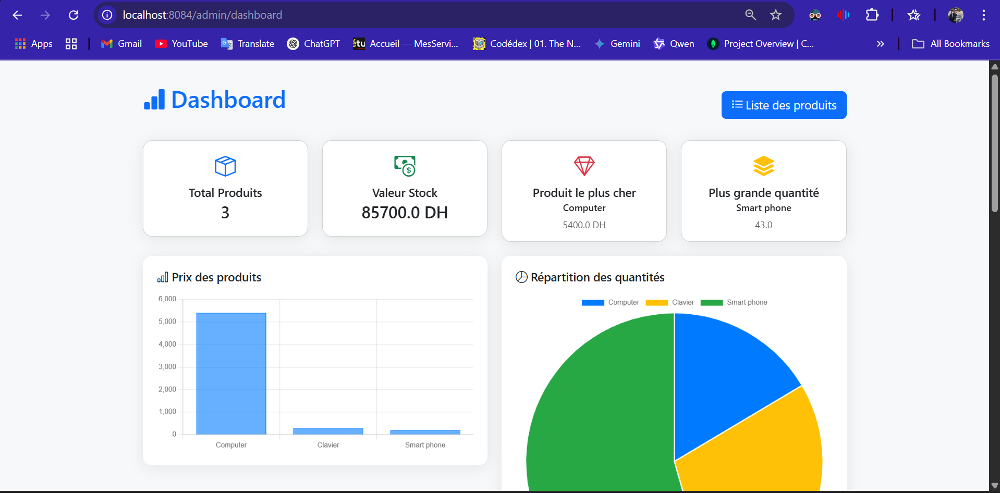
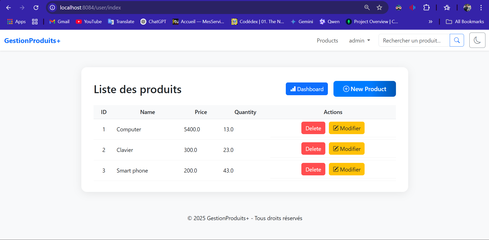
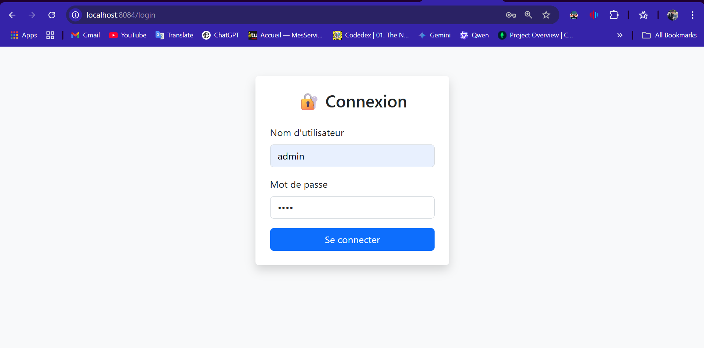
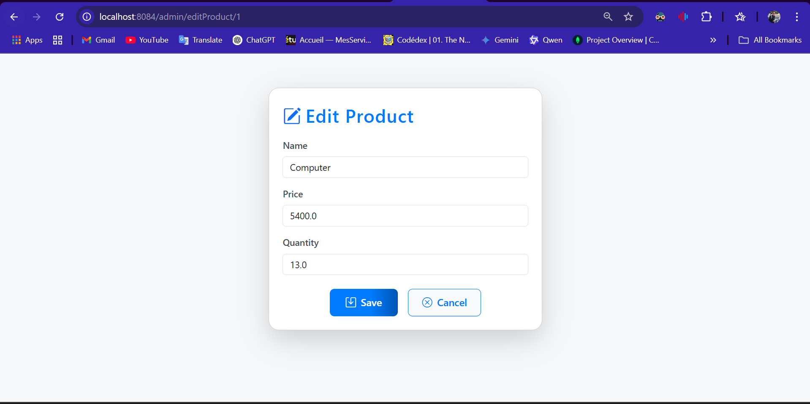
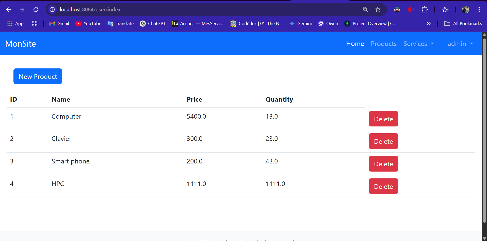
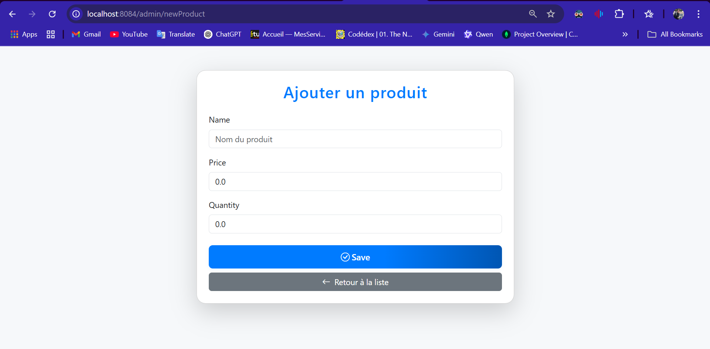
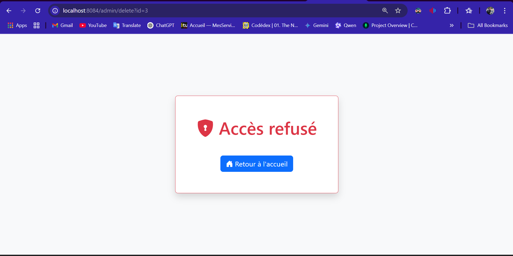
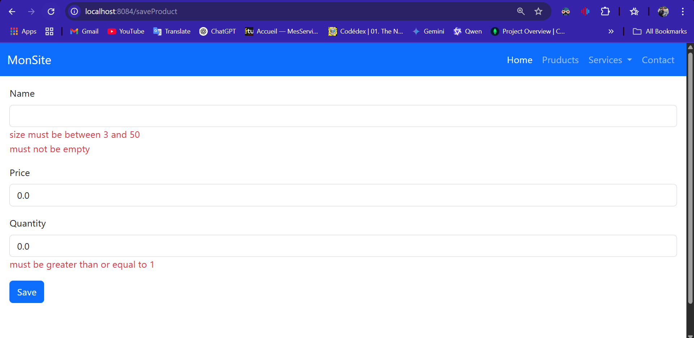

# GestionProduits+ – Application Spring Boot de gestion de produits





---

## Table des matières

1. [Pourquoi Spring ?](#pourquoi-spring-)
2. [Fondamentaux à connaître dans Spring](#fondamentaux-à-connaître-dans-spring)
3. [Notions clés : DI, Relations JPA](#notions-clés--di-relations-jpa)
4. [Dépendances du projet](#dépendances)
5. [Thymeleaf et intégration web](#thymeleaf)
6. [Sécurité : CSRF, Auth, JWT](#sécurité--csrf-auth-jwt)
7. [Structure du projet](#structure-du-projet)
8. [Fonctionnalités principales](#fonctionnalités-principales)
9. [Captures d’écran](#captures-décran)
10. [Installation & Lancement](#installation--lancement)

---

## Pourquoi Spring ?

Dans un système JEE classique :
- Beaucoup de configuration manuelle (servlets, EJB, transactions…)
- Code répétitif, difficile à tester

Spring simplifie tout cela :
| Java EE Classique | Remplacé/Simplifié par Spring |
|-------------------|------------------------------|
| EJB               | Spring Beans + @Service      |
| JNDI              | Injection de dépendances (DI)|
| Transactions      | @Transactional               |
| Servlets/JSF      | Spring MVC                   |
| JDBC/DAO          | Spring Data JPA              |
| XML lourd         | Annotations/Java Config      |

---

## Fondamentaux à connaître dans Spring

- **IoC & DI** : Le conteneur Spring gère les objets (beans) et injecte automatiquement les dépendances via `@Autowired`, `@Component`, etc.
- **Beans** : Un bean est un objet géré par Spring, configuré via annotations ou classes `@Configuration`.
- **Spring MVC** : Alternative légère à Servlets/JSP, utilise `@Controller`, `@RequestMapping`.
- **Spring Data JPA** : Manipule les entités JPA via des interfaces Repository, sans SQL manuel.
- **Spring Security** : Gestion des utilisateurs, rôles, permissions.
- **Spring Boot** : Démarrage rapide, configuration auto, serveur embarqué.

---

## Notions clés : DI, Relations JPA

### Injection de Dépendances (DI)
**Sans DI :**
```java
public class Voiture {
    private Moteur moteur = new Moteur(); // Couplage fort
}
```
**Avec Spring DI :**
```java
@Component
public class Voiture {
    private final Moteur moteur;
    @Autowired
    public Voiture(Moteur moteur) { this.moteur = moteur; }
}
```
➡️ Plus modulaire, testable, découplé.

### Relations JPA
- **Many-to-One** : Plusieurs entités A → une B (`@ManyToOne`)
- **One-to-Many** : Une A → plusieurs B (`@OneToMany(mappedBy=...)`)
- **Many-to-Many** : Plusieurs A ↔ plusieurs B (`@ManyToMany`)

---

## Dépendances

- **H2 Database** : Base en mémoire, idéale pour tests ([console H2](http://localhost:8084/h2-console))
- **Spring Data JPA** : Simplifie l’accès BDD, CRUD auto, relations JPA
- **Lombok** : Génère getters/setters, réduit le boilerplate
- **Spring Web** : Contrôleurs, REST, serveur Tomcat embarqué
- **Thymeleaf** : Moteur de template HTML dynamique
- **Spring Boot DevTools** : Redémarrage auto, live reload

---

## Thymeleaf

Thymeleaf permet de générer dynamiquement du HTML côté serveur :
```html
<p th:text="${product.name}"></p>
```
- Intégré à Spring MVC
- Lisible même sans serveur
- Boucles, conditions, formulaires, fragments, layouts

---

## Sécurité : CSRF, Auth, JWT

- **CSRF** : Protection automatique via token synchronisé dans chaque formulaire.
- **Spring Security** : Toutes les URL sont protégées par défaut, login auto, gestion des rôles.
- **Noop** : `{noop}` pour mots de passe non chiffrés (démo).
- **JWT** : Jeton sécurisé pour authentification stateless (non activé par défaut ici, mais expliqué dans le code).

---

## Structure du projet

```
src/
  main/
    java/
      .../controller/      # Contrôleurs Spring MVC
      .../model/           # Entités JPA (Product, User, etc.)
      .../repository/      # Repositories Spring Data JPA
      .../service/         # Services métier
    resources/
      templates/           # Vues Thymeleaf (layout, dashboard, products, ...)
      static/              # CSS/JS personnalisés
      images/              # Captures d’écran pour la doc
```

---

## Fonctionnalités principales

- **CRUD produits** (création, édition, suppression, recherche)
- **Dashboard** avec statistiques et graphiques dynamiques (Chart.js)
- **Recherche** par nom dans la navbar
- **Tri dynamique** et export PDF/Excel
- **Badges dynamiques** (quantité faible, premium)
- **Mode sombre/clair** avec bouton dans la navbar (🌙/☀️)
- **Toasts/alertes Bootstrap** pour les actions
- **Sécurité** (rôles, login, CSRF)
- **Responsive** (Bootstrap 5)

---

## Captures d’écran

> Place tes images dans `src/main/resources/images/` puis référence-les ainsi :

- 
- 
- 
- 
- 
- 
- 
- )

---

## Installation & Lancement

1. **Cloner le projet**  
   `git clone ...`

2. **Configurer la base de données**  
   (Par défaut H2, voir `application.properties`)

3. **Lancer l’application**  
   ```bash
   ./mvnw spring-boot:run
   # ou
   mvn spring-boot:run
   ```

4. **Accéder à l’application**  
   [http://localhost:8084/](http://localhost:8084/)

---


## Auteur

- IMAD EL KHELYFY
- Année 2025
